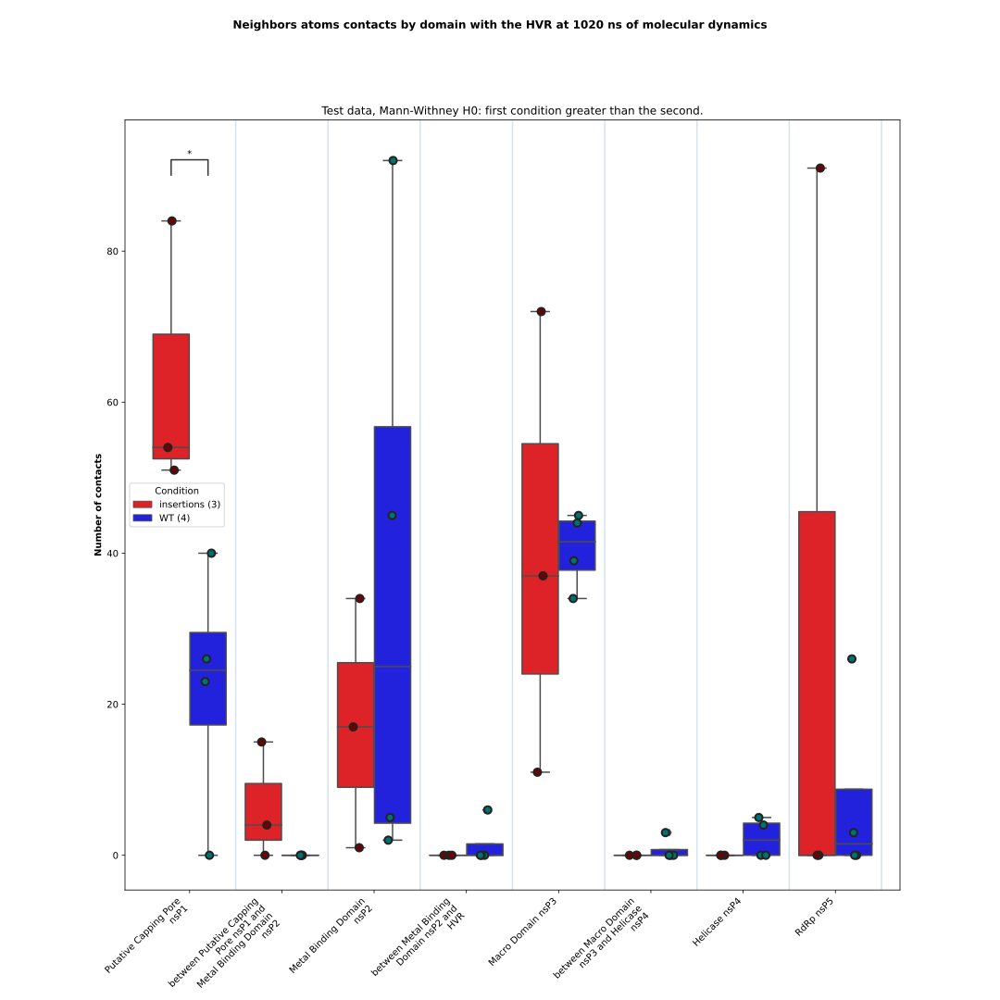
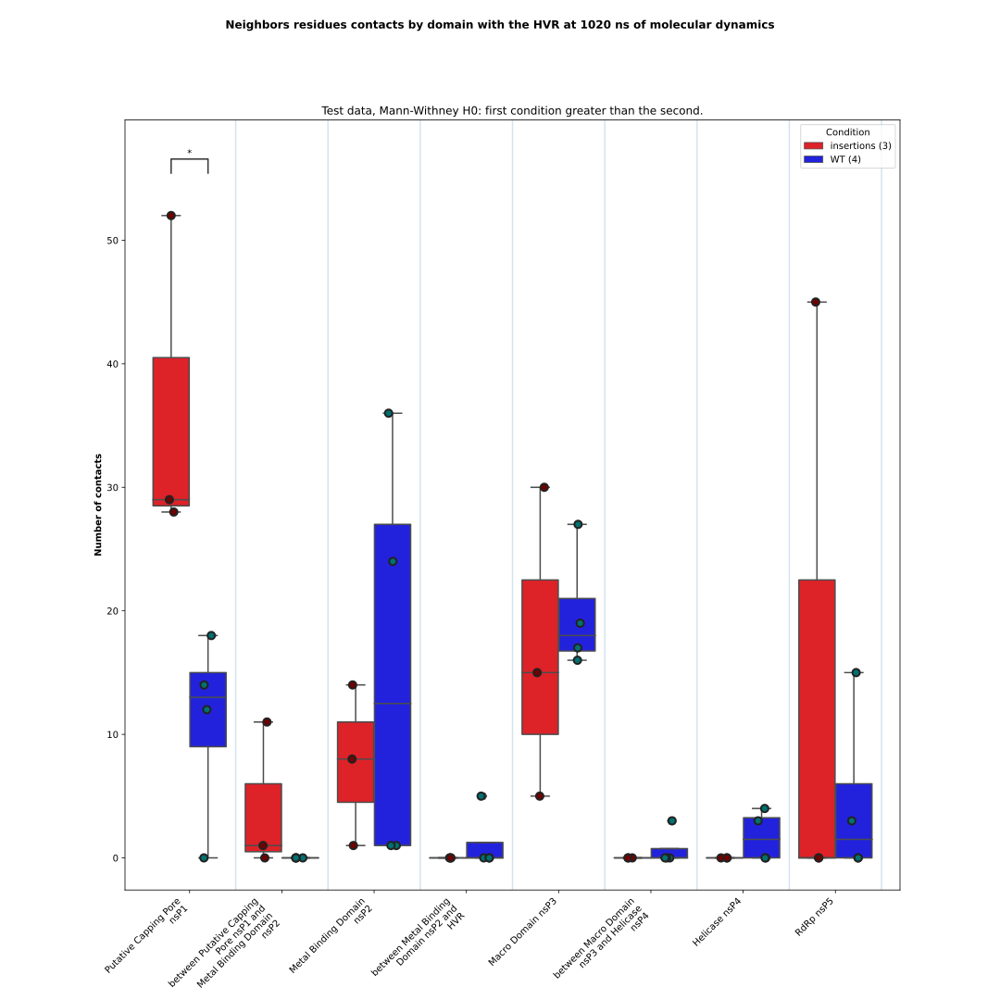

# Neighbors contacts aggregate

From the CSV files describing atomic contacts between a Region of Interest and the protein domains during the Molecular 
Dynamics simulation, the script generates boxplots of neighborhood contacts (at both the atomic and residue levels) for 
each condition. In addition, a file containing the results of the statistical tests is produced.

The input CSV data are produced by the [plot_neighbors](https://github.com/njeanne/plot_neighbors/tree/main) script.

## Conda environment

A [conda](https://docs.conda.io/projects/conda/en/latest/index.html) YAML environment file is provided: 
`conda_env/contacts_aggregate_env.yml`. The file contains all the dependencies to run the script.
The conda environment is generated using the command:
```shell script
# create the environment
conda env create -f conda_env/contacts_aggregate_env.yml

# activate the environment
conda activate contacts_aggregate
```

## Usage

The script can be tested with the test data provided in the `data` directory, which contains a CSV file describing the 
different conditions and the location of the directory containing the CSV output files from the [plot_neighbors.py](https://github.com/njeanne/plot_neighbors) 
script.

The input CSV file must be a comma separated file with a header as in the following example:

| condition    | path | boxplot color | dot color |
|--------------|---|---|---|
| insertions   | data/plot_neighbors_outputs/insertions | #fc030b | #700101 |
| duplications | data/plot_neighbors_outputs/duplications | #eb8c34 | #704001 |
| WT           | data/plot_neighbors_outputs/WT | #0303fc | #017070 |

Some optional arguments can be used:
- `--domain`: which is the path to a CSV file describing the domains of a protein. The order of the domains will be used to order the boxplots in the plot.
- `--group`: to group some conditions of the input CSV file.

The command to use the 3 conditions of the input CSV file is:
```shell script
conda activate contacts_aggregate

./neighbors_aggregate.py --md-time 1002 --region-of-interest DOM1 --domain data/sample_domains.csv \
--subtitle "Test data" --out results data/conditions.csv

conda deactivate
```

## Outputs

The script outputs are:

- a CSV file listing the contacts by condition and domain:

|sample|conditions|domains                                                         |by atom|by residue|
|------|----------|----------------------------------------------------------------|-------|----------|
|ins1  |insertions|Metal Binding Domain nsP2                                       |17     |8         |
|ins1  |insertions|Putative Capping Pore nsP1                                      |54     |29        |
|ins1  |insertions|Macro Domain nsP3                                               |72     |30        |
|ins1  |insertions|RdRp nsP5                                                       |0      |0         |
|ins1  |insertions|Helicase nsP4                                                   |0      |0         |
|ins1  |insertions|between Metal Binding Domain nsP2 and HVR                       |0      |0         |
|ins1  |insertions|between Putative Capping Pore nsP1 and Metal Binding Domain nsP2|0      |0         |
|ins1  |insertions|between Macro Domain nsP3 and Helicase nsP4                     |0      |0         |
|ins2  |insertions|RdRp nsP5                                                       |91     |45        |
|ins2  |insertions|Putative Capping Pore nsP1                                      |51     |28        |
|ins2  |insertions|between Putative Capping Pore nsP1 and Metal Binding Domain nsP2|4      |1         |
|ins2  |insertions|Macro Domain nsP3                                               |11     |5         |
|ins2  |insertions|Metal Binding Domain nsP2                                       |1      |1         |
|ins2  |insertions|Helicase nsP4                                                   |0      |0         |
|ins2  |insertions|between Metal Binding Domain nsP2 and HVR                       |0      |0         |
|ins2  |insertions|between Macro Domain nsP3 and Helicase nsP4                     |0      |0         |
|ins3  |insertions|Metal Binding Domain nsP2                                       |34     |14        |
|ins3  |insertions|Putative Capping Pore nsP1                                      |84     |52        |
|ins3  |insertions|between Putative Capping Pore nsP1 and Metal Binding Domain nsP2|15     |11        |
|ins3  |insertions|Macro Domain nsP3                                               |37     |15        |
|ins3  |insertions|RdRp nsP5                                                       |0      |0         |
|ins3  |insertions|Helicase nsP4                                                   |0      |0         |
|ins3  |insertions|between Metal Binding Domain nsP2 and HVR                       |0      |0         |
|ins3  |insertions|between Macro Domain nsP3 and Helicase nsP4                     |0      |0         |
|wt1   |WT        |Metal Binding Domain nsP2                                       |92     |36        |
|wt1   |WT        |Macro Domain nsP3                                               |34     |17        |
|wt1   |WT        |RdRp nsP5                                                       |0      |0         |
|wt1   |WT        |Helicase nsP4                                                   |0      |0         |
|wt1   |WT        |Putative Capping Pore nsP1                                      |0      |0         |
|wt1   |WT        |between Metal Binding Domain nsP2 and HVR                       |0      |0         |
|wt1   |WT        |between Putative Capping Pore nsP1 and Metal Binding Domain nsP2|0      |0         |
|wt1   |WT        |between Macro Domain nsP3 and Helicase nsP4                     |0      |0         |
|wt2   |WT        |Macro Domain nsP3                                               |39     |19        |
|wt2   |WT        |Putative Capping Pore nsP1                                      |23     |12        |
|wt2   |WT        |between Macro Domain nsP3 and Helicase nsP4                     |3      |3         |
|wt2   |WT        |Helicase nsP4                                                   |4      |4         |
|wt2   |WT        |Metal Binding Domain nsP2                                       |5      |1         |
|wt2   |WT        |RdRp nsP5                                                       |0      |0         |
|wt2   |WT        |between Metal Binding Domain nsP2 and HVR                       |0      |0         |
|wt2   |WT        |between Putative Capping Pore nsP1 and Metal Binding Domain nsP2|0      |0         |
|wt3   |WT        |between Metal Binding Domain nsP2 and HVR                       |6      |5         |
|wt3   |WT        |Putative Capping Pore nsP1                                      |40     |18        |
|wt3   |WT        |Metal Binding Domain nsP2                                       |45     |24        |
|wt3   |WT        |Macro Domain nsP3                                               |45     |16        |
|wt3   |WT        |Helicase nsP4                                                   |5      |3         |
|wt3   |WT        |RdRp nsP5                                                       |3      |3         |
|wt3   |WT        |between Putative Capping Pore nsP1 and Metal Binding Domain nsP2|0      |0         |
|wt3   |WT        |between Macro Domain nsP3 and Helicase nsP4                     |0      |0         |
|wt4   |WT        |RdRp nsP5                                                       |26     |15        |
|wt4   |WT        |Metal Binding Domain nsP2                                       |2      |1         |
|wt4   |WT        |Macro Domain nsP3                                               |44     |27        |
|wt4   |WT        |Putative Capping Pore nsP1                                      |26     |14        |
|wt4   |WT        |Helicase nsP4                                                   |0      |0         |
|wt4   |WT        |between Metal Binding Domain nsP2 and HVR                       |0      |0         |
|wt4   |WT        |between Putative Capping Pore nsP1 and Metal Binding Domain nsP2|0      |0         |
|wt4   |WT        |between Macro Domain nsP3 and Helicase nsP4                     |0      |0         |


- boxplots of the contacts by conditions and domains at the atom and at the residue levels. Mann-Whitney tests with **first condition greater than the second as null hypothesis (`greater`)** are performed for each domain between each pair of conditions.
Only the significant p-values are annotated:
```shell
p-value annotation legend:
      ns: 5.00e-02 < p <= 1.00e+00
       *: 1.00e-02 < p <= 5.00e-02
      **: 1.00e-03 < p <= 1.00e-02
     ***: 1.00e-04 < p <= 1.00e-03
    ****: p <= 1.00e-04
```

At the atom level:


At the residue level:


- the CSV file of the Mann-Whitney test results with **group 1 greater than group 2 as the null hypothesis**, i.e. with the conditions *insertions* and *duplications* grouped:

At the atom level:

|contact with                                                    |group 1   |group 2|p-value             |statistic|test          |H0                           |comment|
|----------------------------------------------------------------|----------|-------|--------------------|---------|--------------|-----------------------------|-------|
|Putative Capping Pore nsP1                                      |insertions|WT     |0.02857142857142857 |12.0     |Mann-Whitney U|insertions is greater than WT|       |
|between Putative Capping Pore nsP1 and Metal Binding Domain nsP2|insertions|WT     |0.061372341162960455|10.0     |Mann-Whitney U|insertions is greater than WT|       |
|Metal Binding Domain nsP2                                       |insertions|WT     |0.8                 |4.0      |Mann-Whitney U|insertions is greater than WT|       |
|between Metal Binding Domain nsP2 and HVR                       |insertions|WT     |0.8758934605050381  |4.5      |Mann-Whitney U|insertions is greater than WT|       |
|Macro Domain nsP3                                               |insertions|WT     |0.6857142857142857  |5.0      |Mann-Whitney U|insertions is greater than WT|       |
|between Macro Domain nsP3 and Helicase nsP4                     |insertions|WT     |0.8758934605050381  |4.5      |Mann-Whitney U|insertions is greater than WT|       |
|Helicase nsP4                                                   |insertions|WT     |0.9386276588370396  |3.0      |Mann-Whitney U|insertions is greater than WT|       |
|RdRp nsP5                                                       |insertions|WT     |0.5773220698201049  |6.0      |Mann-Whitney U|insertions is greater than WT|       |


At the residue level:

|contact with                                                    |group 1   |group 2|p-value             |statistic|test          |H0                           |comment|
|----------------------------------------------------------------|----------|-------|--------------------|---------|--------------|-----------------------------|-------|
|Putative Capping Pore nsP1                                      |insertions|WT     |0.02857142857142857 |12.0     |Mann-Whitney U|insertions is greater than WT|       |
|between Putative Capping Pore nsP1 and Metal Binding Domain nsP2|insertions|WT     |0.061372341162960455|10.0     |Mann-Whitney U|insertions is greater than WT|       |
|Metal Binding Domain nsP2                                       |insertions|WT     |0.7089601740352489  |5.0      |Mann-Whitney U|insertions is greater than WT|       |
|between Metal Binding Domain nsP2 and HVR                       |insertions|WT     |0.8758934605050381  |4.5      |Mann-Whitney U|insertions is greater than WT|       |
|Macro Domain nsP3                                               |insertions|WT     |0.8                 |4.0      |Mann-Whitney U|insertions is greater than WT|       |
|between Macro Domain nsP3 and Helicase nsP4                     |insertions|WT     |0.8758934605050381  |4.5      |Mann-Whitney U|insertions is greater than WT|       |
|Helicase nsP4                                                   |insertions|WT     |0.9386276588370396  |3.0      |Mann-Whitney U|insertions is greater than WT|       |
|RdRp nsP5                                                       |insertions|WT     |0.5773220698201049  |6.0      |Mann-Whitney U|insertions is greater than WT|       |

